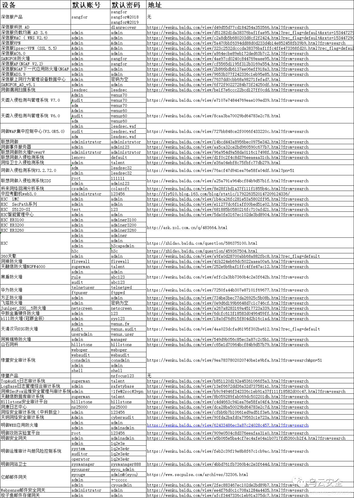

天融信：  
登录地址：https://192.168.1.254、https://192.168.1.254:8080  
用户名：superman  
密码：talent、talent! 23、talent!23  
技术支持热线：8008105119

联想网御：  
登录地址（需要证书，最好用IE浏览器登录）：https://10.1.5.254:8889  
用户名：admin  
密码：leadsec@7766、administrator、bane@7766  
技术支持：4008107766、010-56632666

深信服：  
登录地址：https://10.251.251.251、https://10.254.254.254  
用户名：admin  
密码：admin  
技术支持：4006306430

启明星辰：  
登录地址：https://10.1.5.254:8889、https://10.50.10.45:8889  
用户名：admin  
密码：bane@7766、admin@123  
技术支持：4006243900

H3C：  
登录地址：http://192.168.0.1  
用户名：admin  
密码：admin  
技术支持：4006306430

华为：  
登录地址：http://192.168.0.1  
用户名：admin  
密码：Admin@123  
技术支持：400-822-9999

网神：  
登录地址：https://10.50.10.45  
用户名：admin  
密码：firewall  
技术支持：4006108220

绿盟：  
登录地址：https://192.168.1.101  
用户名：weboper  
密码：weboper  
技术支持：400-818-6868  

juniper：  
登录地址：https://192.168.1.101  
用户名：netscreen  
密码：netscreen

思科：  
登录地址：https://192.168.0.1  
用户名：admin  
密码：cisco

```
天融信防火墙，不需要证书 登录地址:https://192.168.1.254 用户名:superman 密码:talent 技术支持热线：8008105119
天融信防火墙，不需要证书 登录地址:https://192.168.1.254：8080 用户名:superman 密码:talent！23 遇到设备需要把旧设备配置备份下来，再倒入新设备基于console口登陆，用户名，密码跟web界面一致 system config reset 清除配置 save 保存 联想网御防火墙，需要证书（最好用IE浏览器登录）
登录地址:https://10.1.5.254:8889 用户名:admin 密码:leadsec@7766、administrator、bane@7766 技术支持热线：4008107766 010-56632666
深信服防火墙（注安全设备管理地址不是唯一的） https://10.251.251.251
https://10.254.254.254 用户名：admin 密码：admin 技术支持热线：4006306430
启明星辰 https://10.1.5.254:8889 用户名：admin 密码：bane@7766
https://10.50.10.45:8889 用户名：admin 密码：admin@123 电脑端IP：10.50.10.44/255.255.255.0 技术支持热线：4006243900
juniper 登录地址:https://192.168.1.1 用户名:netscreen 密码:netscreen
Cisco 登录地址:https://192.168.0.1 用户名:admin 密码:cisco
Huawei 登录地址:http://192.168.0.1 用户名:admin 密码:Admin@123
H3C 登录地址:http://192.168.0.1 用户名:admin 密码:admin 技术支持热线：4006306430
绿盟IPS https://192.168.1.101 用户名: weboper 密码: weboper 配置重启生效
网神防火墙GE1口 https://10.50.10.45 用户名：admin 密码：firewall 技术支持热线：4006108220
深信服VPN： 51111端口 delanrecover
华为VPN：账号：root 密码：mduadmin
华为防火墙： admin Admin@123 eudemon
eudemon Juniper防火墙： netscreen netscreen
迪普 192.168.0.1 默认的用户名和密码（admin/admin_default)
山石 192.168.1.1 默认的管理账号为hillstone，密码为hillstone
安恒的明御防火墙 admin/adminadmin
某堡垒机 shterm/shterm
天融信的vpn test/123456
```
```
绿盟安全产品默认密码排查列表

IPS入侵防御系统、SAS­H运维安全管理系统、SAS安全审计系统、DAS数据库审计系统、RSAS远程安全评估系统、WAF WEB应用防护系统
sysauditor/sysauditor
sysmanager/sysmanager
supervisor/supervisor
maintainer/maintainer
webpolicy/webpolicy
sysadmin/sysadmin
conadmin/conadmin
supervis/supervis
webaudit/webaudit
sysadmin/sysadmin
conadmin/nsfocus
weboper/weboper
auditor/auditor
weboper/weboper
nsadmin/nsadmin
admin/nsfocus
admin/admin
shell/shell
```


# 参考链接
https://lionking.top/2019/09/15/%E5%90%84%E5%A4%A7%E5%8E%82%E5%95%86%E8%AE%BE%E5%A4%87%E9%BB%98%E8%AE%A4%E5%AF%86%E7%A0%81/
