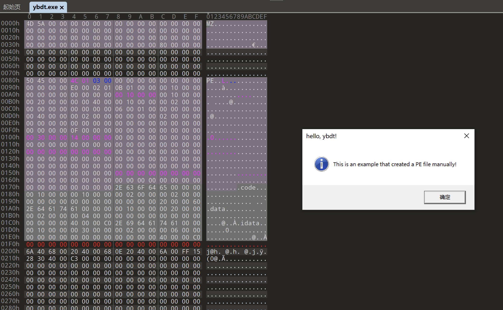

# 学习过程

## 进程虚拟地址空间

一共4GB的虚拟地址空间，进程映像的起始地址通常是0x00400000，高地址处的1G空间通常给内核使用，其余3G空间给用户使用

## 虚拟内存页和物理内存页映射

虚拟内存要映射到物理内存，才会被CPU真正执行，映射到物理内存时，会被分成一块一块4KB大小的内存片，需要的内存片才会被映射到物理内存

## PE32可执行文件包括哪些部分

.code：包含代码

.data：包含数据，例如全局变量

.idata：包含导入表，用于导入Windows API

## FOA、RVA

FOA：File Offset Address（在磁盘中相对于文件头地址的偏移）

RVA：Relative Virtual Address（在内存中相对于起始地址的偏移）

## Bit、Byte、WORD、DWORD

1Byte(字节)=8Bit(位)

1WORD(字)=2Byte(字节)

1DWORD(双字)=4Byte(字节)

1QWORD(四字)=8Byte(字节)

## 大端模式小端模式

大端模式：数据的高字节位于内存低地址处，例如，0x1234，0x12是数据高字节，位于内存低地址处，也就是数据在内存的起始位置

小端模式：数据的低字节位于内存低地址处，例如，0x1234，0x34是数据低字节，位于内存低地址处，也就是数据在内存的起始位置

如下C++代码判断当前CPU是大端小端，经判断当前Intel x64 CPU是小端模式

```
#include <iostream>

using namespace std;

int main()
{
    short int i = 0x1234;
    char x = 0x12;
    char y = 0x34;
    char c = *(char*)&i;

	//低位地址存放的是最高有效字节
	if (c == x)
	{
		cout << "大端模式" << endl;
	}

	//低位地址存放的是最低有效字节
	if (c == y)
	{
		cout << "小端模式" << endl;
	}
}
```

# 最终成果
  

# 参考链接
【PE32格式学习之手动创建一个简单的Windows程序】https://xz.aliyun.com/t/14105